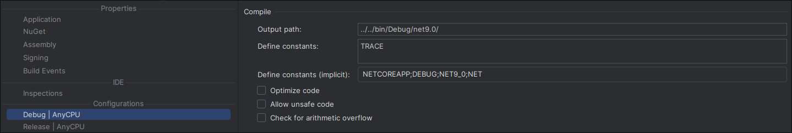
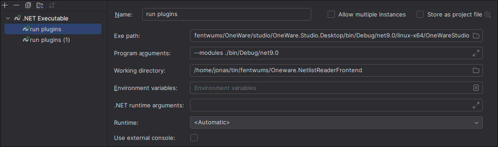

# Prerequisites

To work on developing the netlist viewer, you need to have the following tools installed:

- JDK 21 or higher
- .net 9.0
- maven 3.9 or higher
- (recommended) a Java IDE such as IntelliJ Idea
- (recommended) a C# IDE such as Jetbrains Rider

# Compiling OneWare Studio

**The official developer documentation for plugin development with for OneWare Studio can be found [here](https://one-ware.com/docs/studio/plugins/write-plugin/).**

It is recommended to compile your own version of OneWare Studio for plugin development.
Just clone the OneWare Studio source code [from here](https://github.com/one-ware/OneWare).

It may be necessary to check out a ceratin commit before you can start building OneWare Studio. 
Please check the [readme](https://github.com/FEntwumS/FEntwumS.NetlistViewer/blob/master/README.md) for any such notices.

Once you have completed the previous steps, you can start the compilation.
Please first select the correct project to build (namely `OneWare.Studio.Desktop`), then compile the project.

From the base directory of your local git repo, you should now be able to find the OneWare Studio executable (eg `OneWareStudio.exe`) under `studio/OneWare.Studio.Desktop/bin/Debug/net9.0/[your target platform, eg win-x64]/`.

# Compiling the plugin

In another directory, clone the plugin [repository](https://github.com/FEntwumS/FEntwumS.NetlistViewer).
To be able to directly run the plugin from Rider, add a new run configuration.
For the `Exe path`, enter the directory of the OneWare Studio executable you previously compiled.
For `Program arguments`, enter `--modules ./`.
And for the `Working directory`, enter `[plugin git repo]/src/FEntwumS.NetlistViewer/bin/debug/net9.0`.

If you followed all the instructions, running the configuration should open OneWare Studio with the FEntwumS netlist viewer plugin loaded.

### Plugin Development with multiple projects/plugins

To load multiple plugins/DLLs simultaneously during development in OneWare:

Compile each project into a common build folder.


This folder holds the DLLs from all your compiled projects. In the above example project structure is:

```
project-root/
├── bin/Debug/net9.0/ # Common build folder for compiled plugins/DLLs
    ├── FEntwums.NetlistViewer.dll
    ├── WaveformInteractor.dll
    └── ...
├── src/              # Source code for individual plugins
│   ├── FEntwums.NetlistViewer/
│   │   ├── src/
│   │   ├── FEntwumS.NetlistViewer.csproj
│   │   ├── FEntwumSNetlistReaderFrontendModule.cs
│   │   └── ...
│   ├── FEntwums.WaveformInteractor/
│   │   ├── src/
│   │   ├── FEntwumS.WaveformInteractor.csproj
│   │   ├── FEntwumSWaveformInteractorModule.cs
│   │   └── ...

```

Pass the `./bin/Debug/net9.0` folder as a parameter to the OneWare executable in your IDE's launch configuration:



# Compiling the backend

If you want to work on the backend, please clone the respective git repo and follow the instructions [here](https://github.com/FEntwumS/NetlistReaderBackend?tab=readme-ov-file#build) to compile your own version.

If you want to test any changes you made, start the backend manually using `java -jar fentwums-netlist-reader-server-[version number]-exec.jar` in the  `fentwums-netlist-reader-server/target` directory.

The frontend plugin will automatically use the already running backend.

