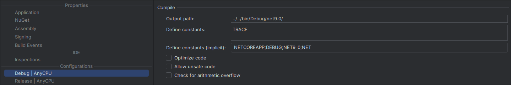

## A brief introduction to OneWare Studio and its plugins

OneWare is built on the [.NET SDK 9.0](https://dotnet.microsoft.com/en-us/download/dotnet/9.0).
It uses the [Avalonia](https://avaloniaui.net/) frontend framework.

To start developing a plugin for OneWare, use the template, OneWare provides and follow the steps here: https://one-ware.com/docs/studio/plugins/write-plugin/.

It is advised to use [Intellij Rider](https://www.jetbrains.com/rider/) to develop the .NET OneWare Plugins. It packs a comprehensive building/running and debugging workflow for .NETs module management.


### Plugin Development with multiple projects/plugins

To load multiple plugins/DLLs simultaneously during development in OneWare:

Compile each project into a common build folder.


This folder holds the DLLs from all your compiled projects. In the above example project structure is:

```
project-root/
├── bin/Debug/net9.0/ # Common build folder for compiled plugins/DLLs
    ├── FEntwums.NetlistViewer.dll
    ├── WaveformInteractor.dll
    └── ...
├── src/              # Source code for individual plugins
│   ├── FEntwums.NetlistViewer/
│   │   ├── src/
│   │   ├── FEntwumS.NetlistViewer.csproj
│   │   ├── FEntwumSNetlistReaderFrontendModule.cs
│   │   └── ...
│   ├── FEntwums.WaveformInteractor/
│   │   ├── src/
│   │   ├── FEntwumS.WaveformInteractor.csproj
│   │   ├── FEntwumSWaveformInteractorModule.cs
│   │   └── ...

```

Pass the `./bin/Debug/net9.0` folder as a parameter to the OneWare executable in your IDE's launch configuration:


### Prism

OneWare currently uses [Prism](https://github.com/PrismLibrary/Prism) to enable loosely coupled development. This also enables plugin development for OneWare.

The plugin registers itself in the container registry, when being loaded in OneWare. 


### NuGet

NuGet is a package manager for the Microsoft development platform, primarily used for managing .NET libraries and dependencies. It the process of incorporating third-party libraries into .NET projects by providing a central repository of reusable code packages.

OneWare uses NuGet to provide its API via shared packages.
This way your OneWare plugin development can always use the newest API OneWare provides for the interaction with your plugin.  
NuGet package management can also be done from Rider.

If your plugin is dependend on another plugins NuGet packages, a local NuGet repositories often make sense. 
Since publishing NuGet repositories in the development of your plugin is often not desired. A local NuGet Feed can be created,then fetched from your .NET project. Look into it [here](https://learn.microsoft.com/en-us/nuget/hosting-packages/local-feeds).